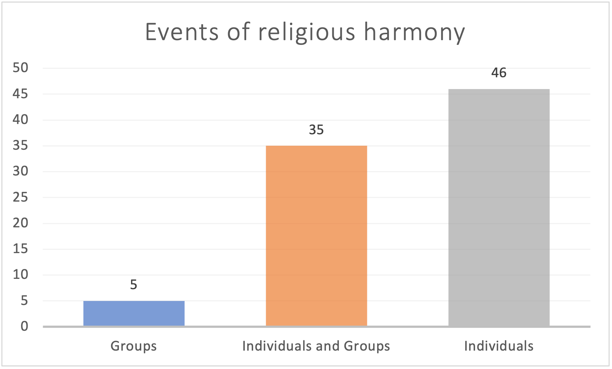

```{r include=FALSE}
library(readr)
library(htmlTable)
library(tidyverse)
library(dplyr)
library(tidyr)
library(tidytext)
library(kableExtra)
```

### Introduction
The Partition is often described as an event that perpetuated existing religious polarities in the Indian subcontinent, and there is a tendency to speak of religious groups in context of the Partition as homogeneous and seamless entities. However, so much of Partition literature as well as post-Partition literature focuses on individuals' narratives and their personal encounters with religion, factionalism, and nationalism. Our understanding of the Partition ceases to be as simple as mere religious disharmony, and we are shown how an individual's motivations oftentimes do not align with their larger group identity.
This phenomenon is particularly prominent in one of the short stories from *Mottled Dawn*, titled *The Last Salute*, in which Subedar Rab Nawaz (a Pakistani soldier) and Ram Singh (an Indian soldier) question the abstract and impersonal agenda they were fighting for after seeing that they were each others' opponents. Their personal history of friendship and mutual support overrode their religious and national identities in the end, putting into question the nature of collective agendas and how much power they have over us. However, even their individual harmony doesn't do anything to prevent general disharmony from existing between Hindus and Muslims, and so we find that the larger group entities may still be at odds despite being internally diverse and complex.

Based on this, our project seeks to find how **religious harmony** manifests in Partition literature, especially when it comes to how many distinguished or discrete individuals (as opposed to cohesive groups with inseparable identities) may be involved in an event relating to religious harmony. This question is valuable to ask because it challenges the widely-held belief about religious groups being homogeneous and having no differentiation in motivations among the individuals that comprise them, and subsequently also provides insight on how authors from the Partition-era might view the way people's behaviour changes based on group vs. individual dynamics.

### Specific Research Question

Is the theme of religious harmony in partition literature represented more frequently through interactions between distinguishable individuals or through groups of characters?

### Queries

**Query 1:** We designed a custom Faceted Search (which we call *Characters in Harmony*) to filter characters appearing in events with religious harmony and observe how the numbers (pluralities) of these characters are distributed. We then iterate through each character involved in these harmonious events, categorising them into single, group, male-dominated group or female-dominated group. This was done in ```R``` and ```Python```.

**Query 2:** 

**(a)** We designed another Faceted Search to filter events where religious harmony occurs. We then iterate through each each event and assign two data-points to the event viz. the number of individuals present, and the number of groups present. This was done in ```MS Excel```.

**(b)** We filter events for religious harmony then iterate through each character involved in these harmonious events, categorising them as above, but also across their religion as mentioned in the DB. This was done in ```R``` and ```Python```.

### Crosstabs
```{r include = FALSE}
crosstabs1 <- read_csv("crosstabs1.csv") 
```
```{r echo=FALSE}
htmlTable(crosstabs1, cgroup= c(" ","Atheist", "Christian", "Hindu", "Muslim", "Sikh", "Unknown", "Totals"), n.cgroup = c(1,3,3,3,3,3,3,3))
```

### Analysis
* From the first query (as well as the resulting crosstab along the **Number** and **Religion** attributes of Characters), we clearly observe that among the events indicative of religious harmony, the characters are overwhelmingly individuals (75.86%). Furthermore, along a gender differential, we observe that male-dominated groups (n = 17) are significantly more represented than female dominated groups (n = 3) in these events.
    
    Along a religious differential, we observe that **Muslim** characters have the highest representation (38.62%) in these harmonious events, followed by **Sikhs** (25.52%) and **Hindus** (16.55%). We note that it is difficult to draw any comparative conclusion along this religious differential as **Muslims** characters have highest frequency in general as well as in events with religious conflicts (30.67%).

* With the second set of queries in ```R``` and ```Python```, we delve deeper into the preliminary results obtained from the Faceted Search and Crosstab data from Heurist. Firstly, counting characters in every religious event separately (and visualising them appropriately as done in the following section) gives us a clear indication that our hypothesis holds true uniformly across every event of religious harmony (and not just the aggregated result). We also get a better understanding of the raw count of individuals appearing in these events, which range anywhere from 1 individual to 11 individuals. This also drives home the point that, even in small groups, the narrator may choose to identify individuals discretely when trying to convey themes of harmony. Finally, the second set of queries establishes the fact that our hypothesis holds uniformly true across characters of every religion. We observe that across characters of all religions mentioned in these events of religious harmony, most of them are represented as distinguished individuals as opposed to groups.

### Visualizations


At a broad level, we observe that of the 88 events that demonstrate religious harmony, 46 events contain interactions only between individuals. This is indicative of the fact that in the partition literature made available to us, religious harmony seems to manifest most in situations where individuals are interacting with each other. This provides us with the impetus to dig deeper and see if this trend persists if we add other aspects such as religion.


There are 88 events (x-axis) with religious harmony in the Partition Database. For each of these events, we count the number of characters and their plurality (single, group, male-dominated or female-dominated). From this plot, it is evident that for all events demonstrating religious harmony, the characters involved are distinguishable individuals. The frequency of Male and Female dominated Groups are marginal and present only for completeness -- we do not infer any valuable insights from them. 

It appears to be a common trend in fiction to represent themes like harmony and discord through individuals for the reader to cathect and relate to. This is consistent with this visualisation.

Note that:

* The columns in the plot aren’t stacked, they are overlaid on top of each other with a transparent color.
* The **Group** category refers to groups of characters where the dominant gender of the group is unclear from the context. It is not a superset of male-dominated and female-dominated groups.


The second plot establishes the fact that the trend of harmonious themes being represented through individuals is consistent irrespective of the religious affiliation of the individual or group. We see that for all religious affiliations represented by the characters in harmonious events, distinguishable individual characters appear far more frequently than groups (of either gender-dominance). 

Note that:

* The columns in the plot aren’t stacked, they are overlaid on top of each other with a transparent color.
* The ‘Group’ category refers to groups of characters where the dominant gender of the group is unclear from the context. It is not a superset of male-dominated and female-dominated groups.

### Reflections
The database entry process forces one to adopt a particular reading style which isn't exactly close reading, but is still very focused on the minuscule details without much room or even encouragement for interpretation (given that the database needs to be an **objective** record). This process was very rewarding when it came to reading *Mottled Dawn*, because it made abundantly clear how seemingly minor characters and minor events have so much rich detail. For instance, a character may just be mentioned once, but we can still know their religious affiliation, their relationship with other characters, their family history, etc. Maybe this characteristic is a function of Partition literature especially, given that so much of it is so heavily based on identity and affiliation, making it natural as well as necessary for authors to slip in details about such attributes.

As for the completed database, one has to be cognizant of how the exercise of database entry was entirely collective, which means that even though we had an idea about the general themes surfacing in our assigned texts, it was very hard to predict what the completed database would look like. This meant that a lot of our initial questions for the project were rendered unusable or inappropriate due to the lack of data we had. While we expected a lot more cases of fatalities based on our own small selection of assigned texts, that didn't seem to be the case for the entire database, making it imperative for us to comb through various entities on Heurist in order to get a bigger picture of the data and what it can do for us.

Finally, when it comes to the opportunities that databases provide, it seems that the crosstabs we created did a lot of the heavy lifting, given their easy readability and interpretation. Choosing the kind of visualizations we wished to use based on those crosstabs felt fairly intuitive and also more useful, which was unlike our experience with Voyant where everything is already presented to the user but the use-cases of the visualizations aren't as apparent or even conducive to our own individual research questions. Speaking specifically on Partition literature, the database also provides a convenient way to deal with relational data. Different entities (such as characters, events, locations etc) exist both independently and in relation to each other, opening up many ways to interpret and visualise the data. 

On the flip side, databases abstract away a lot of valuable information. In our specific use case, while we maintain a record of every event, we do not store the textual data describing it - making semantic and text-based analyses impossible on the data. This might once again be just a function of analysing Partition literature, but any useful analysis or visualization we wanted to conduct held absolutely no room for ambiguity or "reading between the lines" in the texts. This is an important issue because it makes one wonder whether statistical analyses focus too much on categorizing all entities so neatly that a lot of nuance in texts might end up being lost. Does everything really need an identifier, or a concrete identity? In all, it seems that statistical analyses of literature deepen the sign-signifier bond, which isn't necessarily a bad thing, but it certainly shows how statistics is partial to a very specific kind of literary theory. However, given that our assignment was to understand Partition literature using meaningful numerical data, it certainly wasn't an issue as much as it was an ideological puzzle. 