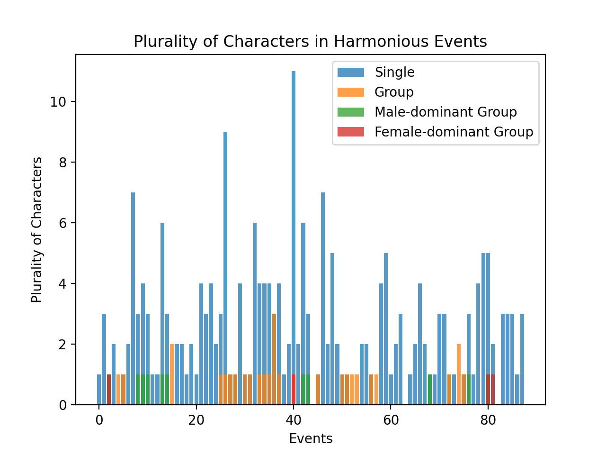
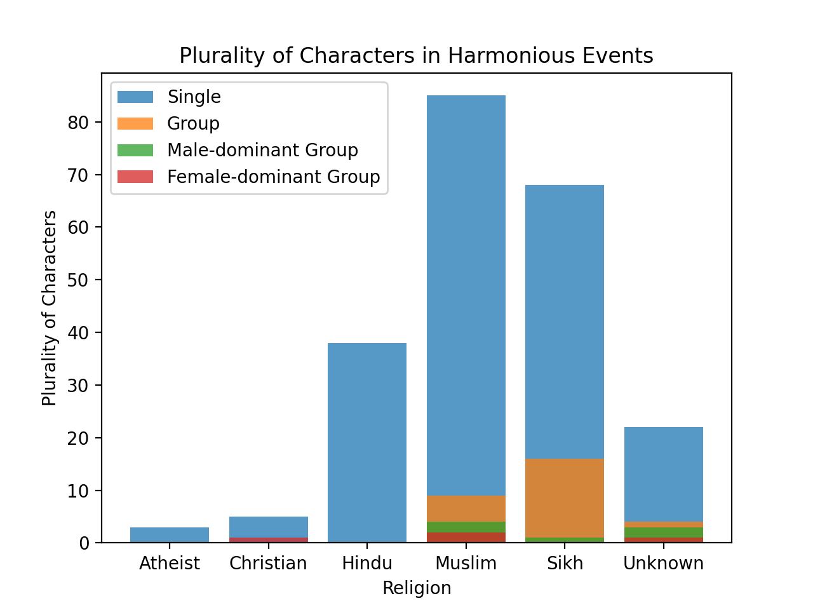

```{r include=FALSE}
library(readr)
library(htmlTable)
library(tidyverse)
library(dplyr)
library(tidyr)
library(tidytext)
library(kableExtra)
```

### Introduction
The Partition is often described as an event that perpetuated existing religious polarities in the Indian subcontinent, and there is a tendency to speak of religious groups in context of the Partition as homogeneous and seamless entities. However, so much of Partition literature as well as post-Partition literature focuses on individuals' narratives and their own personal encounters with religion, factionalism, and nationalism. Our understanding of the Partition ceases to be as simple as mere religious disharmony, and we're shown how an individual's motivations oftentimes do not align with their larger group identity.
This phenomenon is particularly prominent in one of the short stories from Mottled Dawn, titled 'The Last Salute', in which Subedar Rab Nawaz (a Pakistani soldier) and Ram Singh (an Indian soldier) question the abstract and impersonal agenda they were fighting for after seeing that they were each others' opponents. Their own personal history of friendship and mutual support overrode their religious and national identities in the end, putting into question the nature of collective agendas and how much power they have over us. However, even their individual harmony doesn't do anything to prevent general disharmony from existing between Hindus and Muslims, and so we find that the larger group entities may still be at odds despite them being internally diverse and complex.

Based on this, our project seeks to find how religious harmony manifests in Partition literature, especially when it comes to how many distinguished or discrete individuals (as opposed to cohesive groups with inseparable identities) may be involved in an event relating to religious harmony. This question is valuable to ask because it challenges the widely-held belief about religious groups being homogeneous and having no differentiation in motivations among the individuals that comprise them, and subsequently also provides insight on how authors from the Partition-era might view the way people's behaviour changes based on group vs. individual dynamics.

### Specific Research Question

Is the theme of religious harmony in partition literature represented more frequently through interactions between distinguishable individuals or through groups of characters?

### Queries

**Query 1:** We designed a custom Faceted Search (which we call Characters in Harmony) to filter characters appearing in events with religious harmony and observe how the numbers (pluralities) of these characters are distributed

**Query 2:** 

**(a)** We filter events for religious harmony then iterate through each character involved in these harmonious events, categorising them into single, group, male-dominated group or female-dominated group. This was done in ```R``` and ```Python```.

**(b)** We filter events for religious harmony then iterate through each character involved in these harmonious events, categorising them as above, but also across their religion as mentioned in the DB. This was done in ```R``` and ```Python```.

### Crosstabs
```{r include = FALSE}
crosstabs1 <- read_csv("crosstabs1.csv") 
```
```{r}
htmlTable(crosstabs1, cgroup= c(" ","Atheist", "Christian", "Hindu", "Muslim", "Sikh", "Unknown", "Totals"), n.cgroup = c(1,3,3,3,3,3,3,3))
```

### Analysis


### Visualizations


There are 88 events (x-axis) with religious harmony in the Partition Database. For each of these events, we count the number of characters and their plurality (single, group, male-dominated or female-dominated). From this plot, it is evident that for all events demonstrating religious harmony, the characters involved are distinguishable individuals. The frequency of Male and Female dominated Groups are marginal and present only for completeness -- we do not infer any valuable insights from them. 

It appears to be a common trend in fiction to represent themes like harmony and discord through individuals for the reader to cathect and relate to. This is consistent with this visualisation.

Note that:

* The columns in the plot aren’t stacked, they are overlaid on top of each other with a transparent color.
* The **Group** category refers to groups of characters where the dominant gender of the group is unclear from the context. It is not a superset of male-dominated and female-dominated groups.


The second plot establishes the fact that the trend of harmonious themes being represented through individuals is consistent irrespective of the religious affiliation of the individual or group. We see that for all religious affiliations represented by the characters in harmonious events, distinguishable individual characters appear far more frequently than groups (of either gender-dominance). 

Note that:

* The columns in the plot aren’t stacked, they are overlaid on top of each other with a transparent color.
* The ‘Group’ category refers to groups of characters where the dominant gender of the group is unclear from the context. It is not a superset of male-dominated and female-dominated groups. 